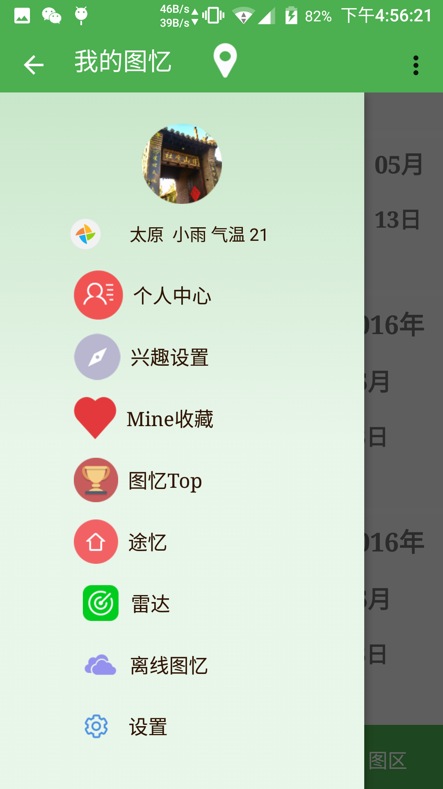
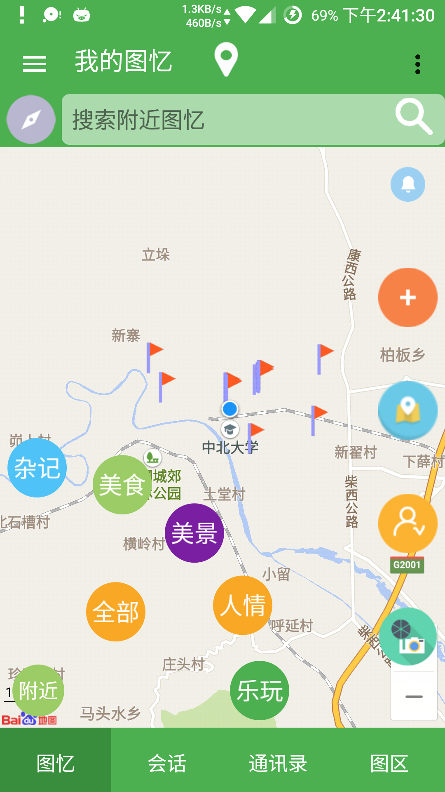
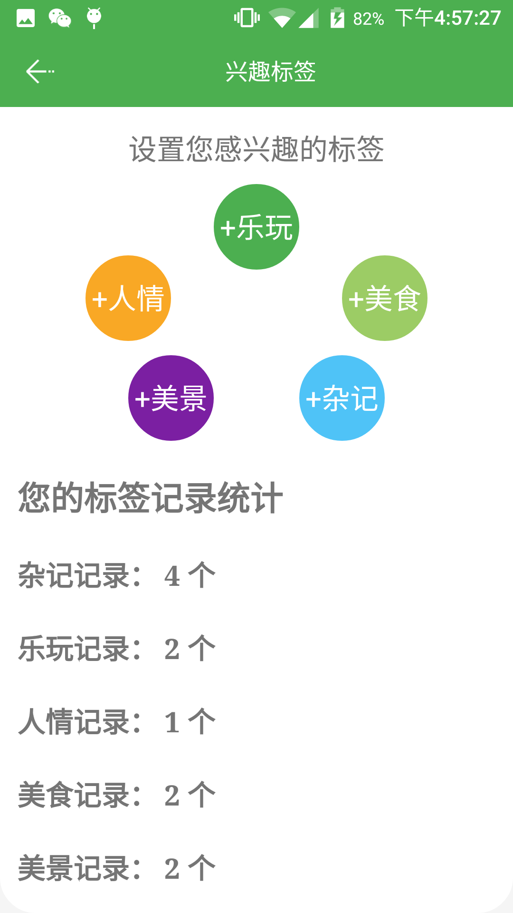
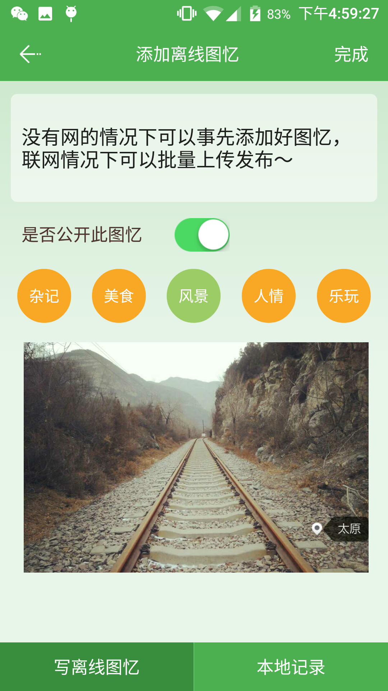
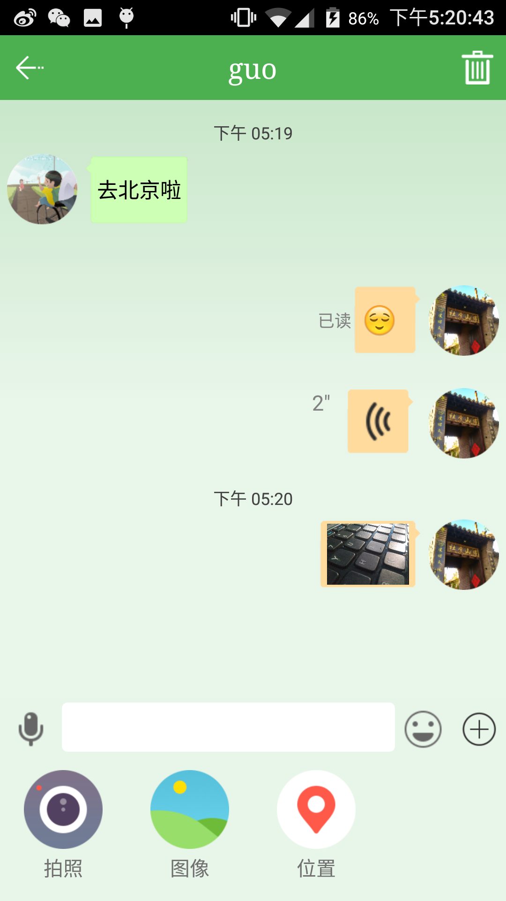
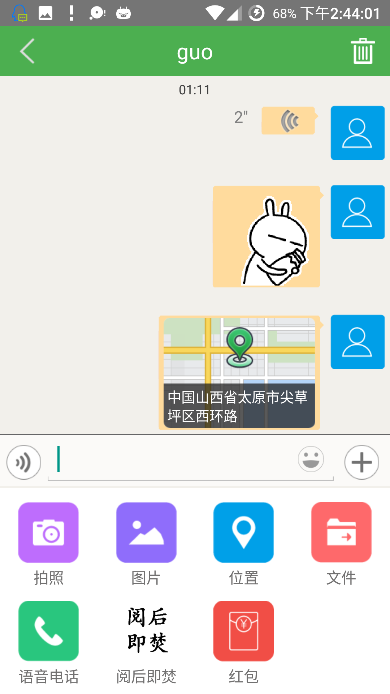
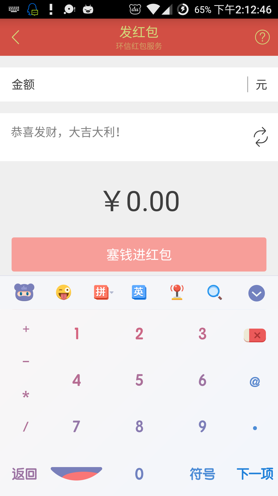

# Tuyi

图忆是一款基于位置信息，将时间空间结合的社交分享与个人事件记录的应用。主要实现了分享的事件在地图上直观呈现，打开地图就能发现附近分享的事件，附近分享搜索，附近用户雷达，个人时间轴记录。此外还有社交聊天，兴趣圈子等功能。

## 2016.7.2的更新：
* 更新环信SDK至2.3.0
* 更换社区为友盟微社区精简版
* 加入红包功能
* 调整主页显示内容

### 关于签名问题
因为配置文件中使用了我的签名文件，使用时请更改为自己的签名文件与签名配置，不然编译会报签名相关的错误。
此外，项目中使用的百度地图，友盟社区，环信IM的 key 与请自行申请替换，谢谢！

##未合并的修改请前往  [newTuyi](https://github.com/donlan/Tuyi/tree/newTuyi)

## Click  [newTuyi](https://github.com/donlan/Tuyi/tree/newTuyi) to see the latest merge 
___
## See some sreenshot
___

___

___
 
___

___

___

___

___

